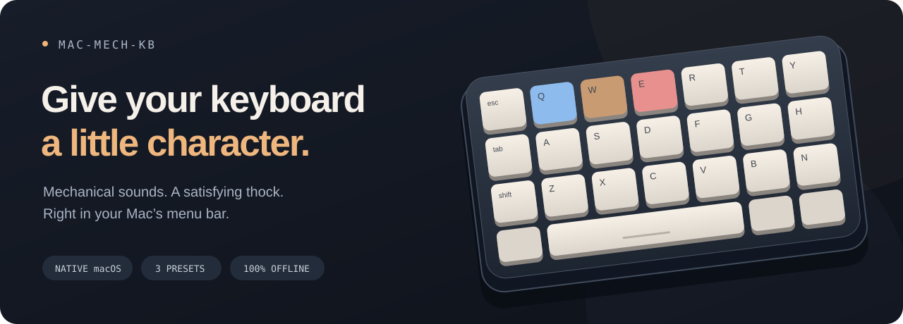

<p align="center">
  
</p>

<p align="center">
  <a href="https://github.com/dark7462/mac-mech-kb/releases/latest"></a>
  
  
  <a href="LICENSE"></a>
</p>

<p align="center">
  <strong>Mechanical keyboard sounds for your Mac. A tiny menu-bar app with a lot of character.</strong><br />
  Blue clicks. Brown taps. Red ticks. Optional extra thock.
</p>

<p align="center">
  <a href="#get-it-on-your-mac">Install</a> ·
  <a href="#pick-your-feel">Sounds</a> ·
  <a href="#small-app-personal-sound">Features</a> ·
  <a href="#build-it-yourself">Build</a> ·
  <a href="https://github.com/dark7462/mac-mech-kb/issues">Feedback</a>
</p>

---

## Get it on your Mac

**[Download the latest DMG →](https://github.com/dark7462/mac-mech-kb/releases/latest)**

macOS **13 Ventura or later** · **Apple Silicon only (M1 and newer)** · No Swift or Xcode needed to install.

1. Open the downloaded `.dmg`.
2. Drag **mac-mech-kb.app** into **Applications**, then eject the disk image.
3. Open the app from Applications. Look for the **keyboard icon in your menu bar**.
4. Choose **Request access** and allow the app in **System Settings → Privacy & Security → Input Monitoring**. Quit and reopen it if macOS asks.
5. Pick a switch, set your volume, and type.

> [!IMPORTANT]
> **This release is not Developer ID signed or notarized by Apple.** If macOS blocks it, first try opening the app, then use **System Settings → Privacy & Security → Open Anyway** for this app if you trust this release. See [Apple's first-launch instructions](https://support.apple.com/102445). You do not need to disable Gatekeeper. Release assets include a SHA-256 checksum.

<details>
<summary><strong>Already running an earlier build?</strong></summary>

Quit the old copy before installing, and remove it afterward if it has a different app name. Keep one copy running at a time. Public releases use the permanent bundle identifier `io.github.dark7462.mac-mech-kb`; builds from before v0.1.0 may need Input Monitoring access and preferences set again.

</details>

## Pick your feel

| Preset | Character | Recorded switch |
| :-- | :-- | :-- |
| 🔵 **Blue** | Bright, crisp, clicky. A little extra pitch. | Cherry MX Blue |
| 🟤 **Brown** | Warm, rounded, tactile. | Hand-lubed WS Brown |
| 🔴 **Red** | Soft, smooth, understated. | Gateron Red |

**Lube on. Thock up.** Flip the Lube switch for a rounder body and softer upper clicks. Automatic level compensation keeps it close to the normal volume. The setting is remembered when you quit.

Lube is a digital sound effect. Each key's tone is tuned from real recordings, with three subtle variations on repeat presses. The source recordings don't identify every physical key; [credits and processing details](AudioLicenses.md) explain how the sounds are made.

## Small app. Personal sound.

- **A voice for each key.** Every supported typing key gets a distinct tone. Chords keep the individual strokes.
- **Ready when you type.** Preloaded audio, independent overlapping playback, and no app-level queue of key sounds.
- **Lives in the menu bar.** Switch presets, toggle Lube, adjust volume, or pause in one place.
- **Remembers your setup.** Preset, volume, Lube, and optional launch at login.
- **Works offline.** No account, service, or audio downloads needed after installation.

### Your typing stays yours

The app uses the hardware key code and repeat flag to choose a sound. It doesn't read typed characters, save a typing history, log key events, or send data anywhere. Sound files are bundled with the app.

## A few things to know

- **Speakers or wired headphones feel most immediate.** Bluetooth earphones can add audio delay.
- **Held keys don't chatter.** Autorepeat, modifiers, F1–F20, and navigation keys are silent. Letters, numbers, punctuation, Tab, Escape, keypad, and international typing keys sound.
- **Secure Input can suppress sounds.** Some password fields and apps prevent global keyboard events from reaching the listener.
- **Audio overlaps freely up to 32 voices.** At capacity, the oldest voice is replaced so new strokes don't wait.
- **Early release.** Tested on the developer's Apple Silicon Mac. Feedback from other M1 and newer Macs is welcome.

## Build it yourself

You'll need an **Apple Silicon Mac (M1 or newer)**, macOS 13+, **Swift 5.9+ command-line tools**, and **Python 3**. Full Xcode is optional.

```sh
git clone https://github.com/dark7462/mac-mech-kb.git
cd mac-mech-kb
zsh Scripts/build_app.sh
open dist/mac-mech-kb.app
```

Build the Apple Silicon app and installer:

```sh
zsh Scripts/build_dmg.sh
```

Builds use the checked-in WAVs and app icon. They don't download or regenerate audio. The packaging script ad-hoc signs the app for integrity; Developer ID signing and notarization require an Apple Developer certificate and a separate release process.

The DMG shows the app, an Applications shortcut, and a “Drag me to Applications” guide. Its first build installs the pinned [dmgbuild](https://dmgbuild.readthedocs.io/) packaging tool into `.build/dmg-tools`; later builds reuse it. No system Python packages or Finder preferences are changed.

<details>
<summary><strong>Tests, audio previews, and asset preparation</strong></summary>

```sh
# Routing, preferences, per-key sounds, overlap, Lube levels, and asset checks
zsh Scripts/test_cli.sh

# Also render Lube on/off previews through the real audio engine
zsh Scripts/test_cli.sh --write-previews

# Rebuild the bundled audio from the original CC0 recordings
python3 Scripts/prepare_recorded_sounds.py
python3 Scripts/verify_sounds.py

# Redraw the native app icon
swift Scripts/prepare_icon.swift

# Redraw the Retina installer background
swift Scripts/prepare_dmg_art.swift
```

Tests render audio into memory. They don't play through your speakers, request keyboard access, or change login settings. Restricted runners need access to macOS audio components. Generated apps, installers, caches, and previews stay in ignored directories.

</details>

<details>
<summary><strong>Around the project</strong></summary>

```text
Sources/MacMechKB/
├── App/          Menu-bar UI and lifecycle
├── Audio/        Playback, per-key voicing, and Lube
├── Keyboard/     Event listener and key routing
├── Settings/     Preferences and permissions
└── Resources/    Bundle metadata and recorded sounds
Assets/           App icon and installer artwork
docs/             README artwork
Scripts/          Build, package, prepare, verify
Tests/            Swift and Python regression checks
AudioSources/     CC0 originals, provenance, and hashes
```

</details>

---

<p align="center">
  Built with SwiftUI + AVAudioEngine.<br />
  Code: <a href="LICENSE">MIT</a> · Recordings: <a href="AudioLicenses.md">CC0, with credits</a><br /><br />
  <a href="https://github.com/dark7462/mac-mech-kb/issues">Found a bug or have a sound suggestion?</a>
</p>
